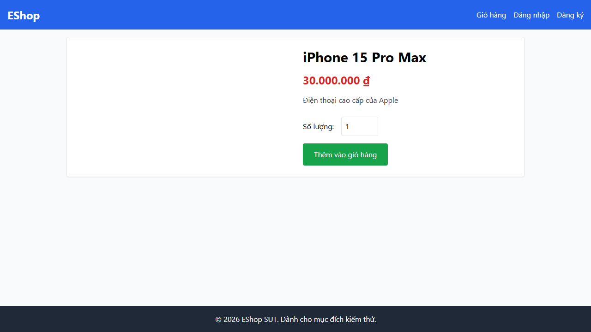
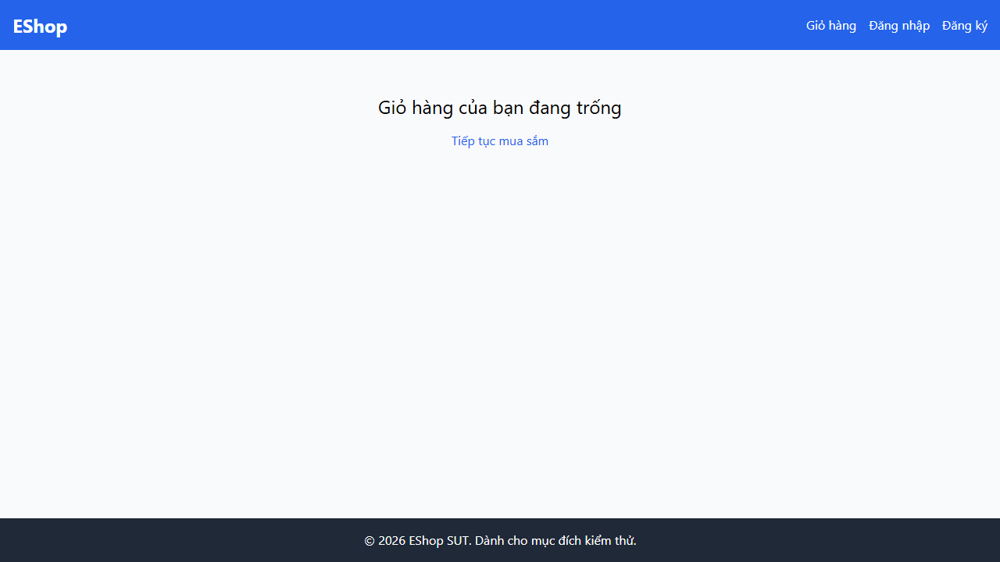
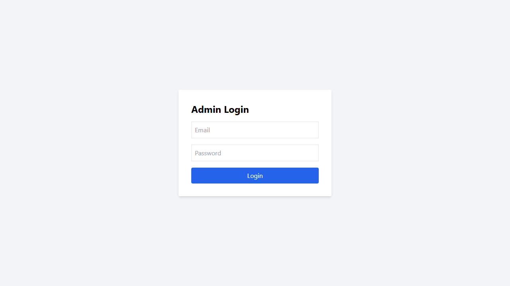
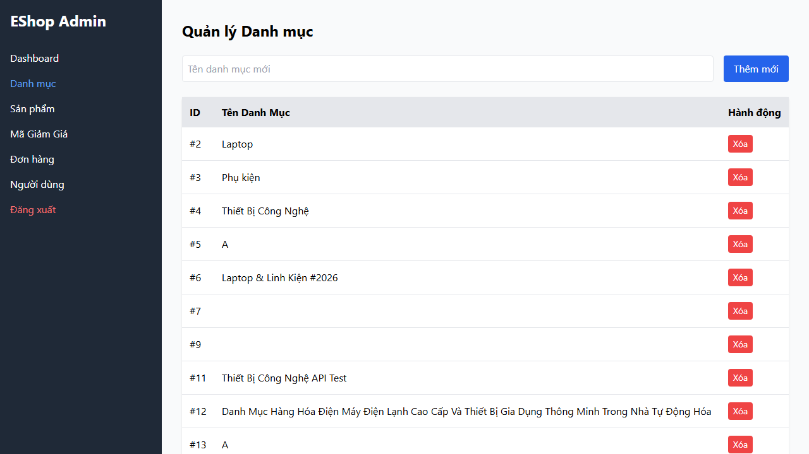

# BÁO CÁO PHÁT HIỆN LỖI HỆ THỐNG SUT (BUG REPORT)

> **Môn học:** CS423 / CSC15003 — Kiểm chứng Phần mềm  
> **Sinh viên:** HỒ GIA HUY  
> **MSSV:** 23127376  
> **Lớp:** 23KTPM2 / 23CLC  
> **Hệ thống kiểm thử (SUT):** EShop Application  

---

## TỔNG QUAN CÁC BUG PHÁT HIỆN QUA TỰ ĐỘNG HÓA KIỂM THỬ

Qua quá trình thực thi 108 test runs của bộ kịch bản tự động hóa Playwright trên 3 tính năng (**FR-06**, **FR-07**, **FR-14**), bộ kiểm thử đã phát hiện **5 lỗi nghiêm trọng (defects/bugs)** thực tế trên hệ thống SUT EShop.

---

### BUG-01 (FR-06): Nút "Thêm vào giỏ hàng" yêu cầu nhấp 2 lần mới gửi Request API

- **Mã lỗi (Bug ID):** `BUG-FR06-01`
- **Tính năng liên quan:** FR-06 — Xem chi tiết sản phẩm (Product Detail View)
- **Mức độ nghiêm trọng (Severity):** Major (Ảnh hưởng trực tiếp trải nghiệm mua sắm)
- **Mô tả ngắn:** Nhấp 1 lần nút "Thêm vào giỏ hàng" trên trang chi tiết sản phẩm không phát request POST `/api/cart`. Người dùng bắt buộc phải nhấp nút lần thứ 2.
- **Các bước tái hiện (Steps to Reproduce):**
  1. Truy cập `http://localhost:5173/product/1`.
  2. Bấm nút "Thêm vào giỏ hàng" 1 lần duy nhất.
  3. Mở Tab Network Developer Tools: Không có request API `/api/cart` nào xuất hiện.
  4. Bấm lần thứ 2: Request POST `/api/cart` mới được khởi tạo.
- **Kết quả thực tế (Actual Result):** Cần nhấp 2 lần mới thêm được sản phẩm vào giỏ.
- **Kết quả kỳ vọng (Expected Result):** Nhấp 1 lần duy nhất phải phát ngay request API POST `/api/cart`.
- **Bằng chứng kiểm thử tự động:** `TC04` trong file `fr06-product-detail.spec.js` bị timeout ở `page.waitForResponse`.
- **Ảnh minh chứng lỗi (Screenshot Evidence):**
  
- **Link GitHub Issue:** *(Tham chiếu GitHub Issues repo của sinh viên)*

---

### BUG-02 (FR-07): Mất toàn bộ dữ liệu giỏ hàng khi làm mới trang (F5)

- **Mã lỗi (Bug ID):** `BUG-FR07-01`
- **Tính năng liên quan:** FR-07 — Giỏ hàng (Shopping Cart)
- **Mức độ nghiêm trọng (Severity):** Critical (Mất dữ liệu giao dịch người dùng)
- **Mô tả ngắn:** Dữ liệu giỏ hàng chỉ được lưu vào React State tạm thời của Client Web. Khi người dùng bấm F5 hoặc mở lại trang `/cart`, toàn bộ giỏ hàng bị xóa sạch về trạng thái rỗng.
- **Các bước tái hiện (Steps to Reproduce):**
  1. Thêm 2 sản phẩm vào giỏ hàng.
  2. Truy cập trang giỏ hàng `http://localhost:5173/cart`.
  3. Bấm F5 (Refresh trình duyệt).
  4. Quan sát: Giỏ hàng hiển thị "Giỏ hàng trống".
- **Kết quả thực tế (Actual Result):** Dữ liệu giỏ hàng bị xoá khi Refresh trang.
- **Kết quả kỳ vọng (Expected Result):** Giỏ hàng phải được đồng bộ và lưu trữ trong CSDL Backend hoặc SessionStorage.
- **Bằng chứng kiểm thử tự động:** `TC06` & `TC12` trong file `fr07-shopping-cart.spec.js` bị fail.
- **Ảnh minh chứng lỗi (Screenshot Evidence):**
  
- **Link GitHub Issue:** *(Tham chiếu GitHub Issues repo của sinh viên)*

---

### BUG-03 (FR-07): Thêm sản phẩm trùng lặp tạo dòng mới thay vì cộng dồn số lượng

- **Mã lỗi (Bug ID):** `BUG-FR07-02`
- **Tính năng liên quan:** FR-07 — Giỏ hàng (Shopping Cart)
- **Mức độ nghiêm trọng (Severity):** Medium (Sai sót logic tính toán giỏ hàng)
- **Mô tả ngắn:** Khi chọn thêm cùng 1 sản phẩm nhiều lần vào giỏ, hệ thống tạo thêm các dòng trùng lặp trong bảng thay vì giữ nguyên 1 dòng và tăng chỉ số số lượng (Quantity).
- **Các bước tái hiện (Steps to Reproduce):**
  1. Thêm sản phẩm ID = 1 vào giỏ hàng với số lượng 1.
  2. Quay lại trang sản phẩm ID = 1 và tiếp tục bấm "Thêm vào giỏ hàng".
  3. Mở giỏ hàng `/cart`.
- **Kết quả thực tế (Actual Result):** Bảng hiển thị 2 dòng sản phẩm ID = 1 giống hệt nhau.
- **Kết quả kỳ vọng (Expected Result):** Bảng chỉ hiển thị 1 dòng duy nhất cho sản phẩm ID = 1 với `Quantity = 2`.
- **Bằng chứng kiểm thử tự động:** `TC02` trong file `fr07-shopping-cart.spec.js` bị fail.
- **Ảnh minh chứng lỗi (Screenshot Evidence):**
  
- **Link GitHub Issue:** *(Tham chiếu GitHub Issues repo of student)*

---

### BUG-04 (FR-14): Hỏng phân quyền RBAC — Tài khoản User thường vẫn tạo được danh mục

- **Mã lỗi (Bug ID):** `BUG-FR14-01`
- **Tính năng liên quan:** FR-14 — Quản lý danh mục & FR-12 Access Control
- **Mức độ nghiêm trọng (Severity):** High / Security Vulnerability (Lỗ hổng bảo mật phân quyền)
- **Mô tả ngắn:** Backend Express API (`server.js`) trong hàm middleware `authenticateToken` chỉ kiểm tra JWT Token hợp lệ mà không kiểm tra quyền `role === 'admin'`. Tài khoản role User thường vẫn gửi request POST `/api/categories` và tạo danh mục thành công trong CSDL.
- **Các bước tái hiện (Steps to Reproduce):**
  1. Đăng nhập bằng tài khoản User thường `test@eshop.com`.
  2. Lấy JWT Token từ HTTP Response.
  3. Gửi request `POST http://localhost:3000/api/categories` kèm Header `Authorization: Bearer <user_token>`.
- **Kết quả thực tế (Actual Result):** API trả về status `201 Created` và tạo thành công danh mục.
- **Kết quả kỳ vọng (Expected Result):** API bắt buộc phải trả về status `401 Unauthorized` hoặc `403 Forbidden`.
- **Bằng chứng kiểm thử tự động:** `TC09` trong file `fr14-category-management.spec.js` assert HTTP Status 401/403 bị fail.
- **Ảnh minh chứng lỗi (Screenshot Evidence):**
  
- **Link GitHub Issue:** *(Tham chiếu GitHub Issues repo của sinh viên)*

---

### BUG-05 (FR-14): Cho phép tạo danh mục với tên rỗng và chỉ chứa khoảng trắng

- **Mã lỗi (Bug ID):** `BUG-FR14-02`
- **Tính năng liên quan:** FR-14 — Quản lý danh mục (Category CRUD)
- **Mức độ nghiêm trọng (Severity):** Medium (Thiếu Ràng buộc Validation dữ liệu)
- **Mô tả ngắn:** Giao diện Form Admin không có thuộc tính `required` và Backend không validate chuỗi rỗng `""` hoặc chuỗi khoảng trắng `"   "`, dẫn đến CSDL bị chèn các danh mục rỗng.
- **Các bước tái hiện (Steps to Reproduce):**
  1. Truy cập phân hệ Admin `http://localhost:5174`.
  2. Để trống ô "Tên danh mục mới" và bấm nút "Thêm mới".
  3. Quan sát: Bảng danh mục xuất hiện một hàng rỗng mới.
- **Kết quả thực tế (Actual Result):** Tạo thành công danh mục rỗng.
- **Kết quả kỳ vọng (Expected Result):** Form phải hiển thị thông báo lỗi hoặc chặn không cho gửi form.
- **Bằng chứng kiểm thử tự động:** `TC05` & `TC06` trong file `fr14-category-management.spec.js` bị fail.
- **Ảnh minh chứng lỗi (Screenshot Evidence):**
  
- **Link GitHub Issue:** *(Tham chiếu GitHub Issues repo của sinh viên)*
